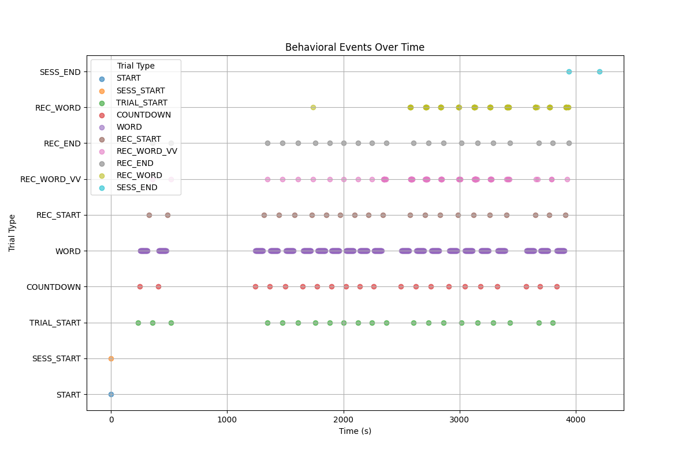

# Free Recall of Word Lists with Repeated Items

## Table of Contents
- [Free Recall of Word Lists with Repeated Items](#free-recall-of-word-lists-with-repeated-items)
  - [Table of Contents](#table-of-contents)
    - [Description](#description)
    - [Notes](#notes)
    - [Issues](#issues)
    - [Dataset Exploring](#dataset-exploring)
      - [What is Events Data](#what-is-events-data)
    - [What is List](#what-is-list)

### Description
This dataset contains behavioral events and intracranial electrophysiological recordings from a repated item free recall task.  The experiment consists of participants studying a list of words, presented visually one at a time, and then freely recalling the words from the just-presented list in any order. On each list, there is a 7-second delay period between the encoding and recall phases.  The data were collected at clinical sites across the country as part of a collaboration with the Computational Memory Lab at the University of Pennsylvania.

The main manipulation in this paradigm is the repetition of items in the studied list. In total, each list contains 27 encoding events, but only 12 unique words: 3 are presented one time, 3 are presented two times, and 6 are presented three times.  

### Notes
* The duration of the encoding events (i.e., length of word presentation) varies among sessions.  For some sessions, the words remained on screen from 750 ms, while in other sessions presentation lasted for 1600 ms. The `duration` column of the events tsv files contains this information.
* The iEEG recordings are labeled either "monopolar" or "bipolar."  The monopolar recordings are referenced (typically a mastoid reference), but should always be re-referenced before analysis.  The bipolar recordings are referenced according to a paired scheme indicated by the accompanying bipolar channels tables.
* Each subject has a unique montage of electrode locations.  MNI and Talairach coordinates are provided when available.
* Recordings done with the Blackrock system are in units of 250 nV, while recordings done with the Medtronic system are estimated through testing to have units of 0.1 uV.  We have completed the scaling to provide values in V.

### Issues

* Neural Patterns of Repetition Enhancement vs. Suppression:
  * Analyze how neural responses change across repetitions of the same word.
  * Identify brain regions showing repetition enhancement (increased activity) vs. suppression (decreased activity).
  * Correlate these patterns with recall performance to understand their functional significance.

* Time-Frequency Analysis of Memory Formation:
  *  Perform time-frequency decomposition of iEEG signals during encoding.
  *  Compare spectral signatures of words that were later recalled vs. forgotten.
  *  Investigate how these signatures change across repetitions and relate to recall probability.

* Neural Dynamics of Spacing Effect:
  * Analyze how the temporal spacing between repetitions affects neural responses and recall performance.
  * Investigate whether optimal spacing intervals can be predicted from neural data.

* Cross-Frequency Coupling and Memory Formation:
  * Examine how interactions between different frequency bands (e.g., theta-gamma coupling) relate to successful encoding and recall.
  * Investigate if these coupling patterns change with item repetition.

* Network Analysis of Memory Processes:
  * Use graph theory to analyze functional connectivity patterns during encoding and recall.
  * Investigate how network properties (e.g., modularity, hub regions) change with repetition and predict recall performance.

* Single-Trial Decoding of Memory States:
  * Use machine learning techniques to decode memory states (e.g., subsequently remembered vs. forgotten) from single-trial neural data.
  * Investigate how decoding accuracy changes with repetition.

* Neural Reinstatement During Recall:
  * Analyze whether patterns of neural activity during encoding are reinstated during successful recall.
  * Investigate how reinstatement strength relates to the number of repetitions during encoding.

* Temporal Dynamics of Free Recall:
  * Analyze the neural correlates of recall order and inter-response times.
  * Investigate how repetition during encoding affects the temporal dynamics of recall.

* Individual Differences in Repetition Effects:
  * Analyze how individual differences in neural responses to repetition relate to overall memory performance.
  * Investigate whether these differences can predict performance in other cognitive tasks.

* Contextual Reinstatement and Repetition:
  * Analyze how contextual information (e.g., temporal, semantic) is encoded and reinstated during recall.
  * Investigate how repetition affects the strength and nature of contextual representations.

* Oscillatory Entrainment and Memory Formation:
  * Investigate whether the presentation rate of words entrains neural oscillations.
  * Analyze how this entrainment relates to memory performance and interacts with item repetition.

* Multi-Modal Integration of Memory Processes:
  * Combine iEEG data with other available modalities (e.g., MRI for precise localization).
  * Investigate how structural connectivity relates to functional dynamics during memory tasks.

### Dataset Exploring

#### What is Events Data
| Onset   | Duration | Sample | Trial Type  | Response Time | Stim File                  | Item Name | Serial Pos | Repeats | List | Experiment | Session | Subject |
|---------|----------|--------|-------------|---------------|----------------------------|-----------|------------|---------|------|------------|---------|---------|
| 0.0     | 0.008    | 11048  | START       | n/a           | n/a                        | n/a       | -999       | -999    | 0    | RepFR1     | 0       | R1204T  |
| 0.008   | 232.234  | 11056  | SESS_START  | n/a           | n/a                        | n/a       | -999       | -999    | 0    | RepFR1     | 0       | R1204T  |
| 232.242 | 13.752   | 243290 | TRIAL_START | n/a           | n/a                        | n/a       | -999       | -999    | 0    | RepFR1     | 0       | R1204T  |
| 245.994 | 3.0      | 257042 | COUNTDOWN   | n/a           | n/a                        | n/a       | -999       | -999    | 0    | RepFR1     | 0       | R1204T  |
| 250.127 | 1.6      | 261175 | WORD        | n/a           | wordpools/wordpool_EN.txt  | HORN      | 0          | 3       | 0    | RepFR1     | 0       | R1204T  |
| 252.544 | 1.6      | 263592 | WORD        | n/a           | wordpools/wordpool_EN.txt  | ARCH      | 1          | 1       | 0    | RepFR1     | 0       | R1204T  |
| 255.095 | 1.6      | 266143 | WORD        | n/a           | wordpools/wordpool_EN.txt  | SPONGE    | 2          | 3       | 0    | RepFR1     | 0       | R1204T  |
| 257.562 | 1.6      | 268610 | WORD        | n/a           | wordpools/wordpool_EN.txt  | ROCK      | 3          | 3       | 0    | RepFR1     | 0       | R1204T  |
| 260.046 | 1.6      | 271094 | WORD        | n/a           | wordpools/wordpool_EN.txt  | THREAD    | 4          | 3       | 0    | RepFR1     | 0       | R1204T  |

### What is List
For detailed analysis of list increments and transition events, refer to the [List Increment Analysis](./output/list_increment_analysis.txt) file.